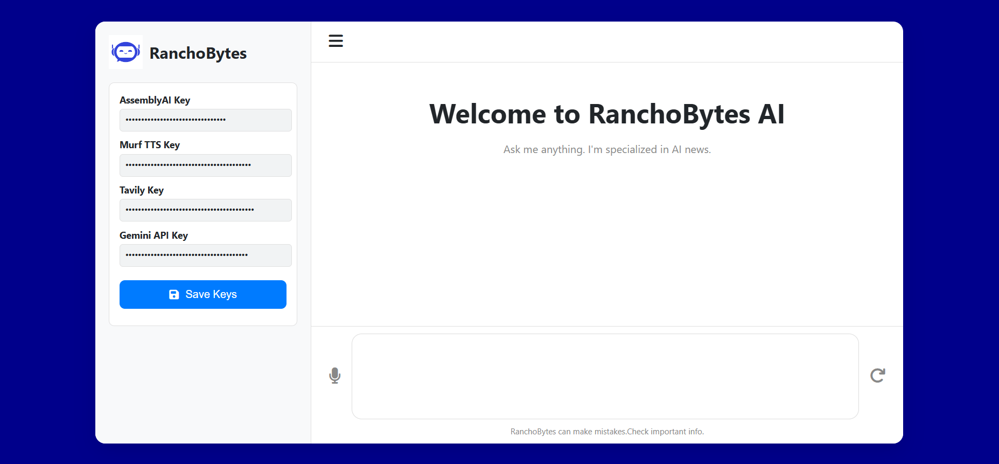

# 🗨️ AI Voice Chat Agent

Talk to an AI using your voice with this interactive AI Voice Chat Agent. It uses your microphone for real-time conversation, powered by Google Gemini, AssemblyAI for speech-to-text, and Murf TTS for natural-sounding voice output. This project is ideal for creating smart assistants, conversational chatbots, or voice-based applications.

## 🎯 How It Works

1. 🎙️ Speak into your mic → Browser captures audio.
2. 🔊 STT (AssemblyAI) transcribes speech into text.
3. 🧠 AI (Gemini 2.5) generates a relevant response.
4. 🎧 TTS (Murf AI) turns the response into speech.
5. ♾️ Loop – The AI listens again for your reply.

## Screenshots




## 🛠️ Tech Stack

-- *Frontend*: HTML, CSS, JavaScript, Web Audio API
-- *Backend*: FastAPI, Python
-- *AI Model*: Google Gemini 2.5 Flash
-- *Speech-to-Text*: AssemblyAI
-- *Text-to-Speech*: Murf AI

## 📂 Project Structure
```
backend/
  app/
    core/
      config.py            # env + constants
      logging_config.py    # logging setup
    routers/
      chat.py              # /agent/chat endpoint
    schemas/
      chat.py              # pydantic response models
    services/
      stt_service.py       # AssemblyAI transcription
      tts_service.py       # Murf TTS synthesis
      llm_service.py       # Gemini chat
    main.py                # FastAPI app factory & router wiring
  run.py                   # uvicorn entry
frontend/
  index.html, style.css, script.js, images/
venv
.env  
```

## 📦 Dependencies

fastapi
uvicorn
requests
python-dotenv
google-genai
assemblyai

## Environment
Create a `.env` in project root:
```
GEMINI_API_KEY=...
MURF_API_KEY=...
ASSEMBLYAI_API_KEY=...
STATIC_DIR=./frontend
```

## Install Backend Dependencies
```bash
cd backend
pip install -r requirements.txt

```

## Run the Backend Server
```bash

uvicorn app.main:app --reload

```

Open: http://localhost:8000/
Static files served from `/static` → `frontend/`.

## 💡 Author

*Mohd Azeem* | https://github.com/17azeem
