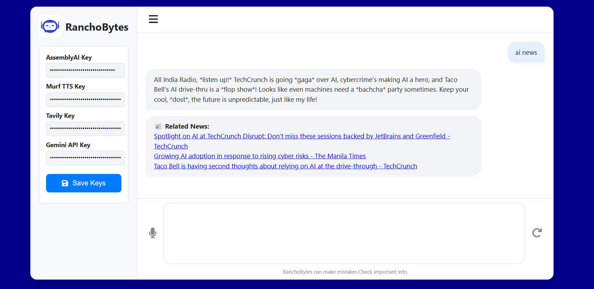

# 🗨️ AI Voice Chat Agent

Talk to an AI using your voice with this interactive AI Voice Chat Agent. It uses your microphone for real-time conversation, powered by Google Gemini, AssemblyAI for speech-to-text, and Murf TTS for natural-sounding voice output. This project is ideal for creating smart assistants, conversational chatbots, or voice-based applications.

👉 Now enhanced with a **News Skill** powered by **Tavily** – so you can ask it for the **latest AI news with links to sources**. 

## 🎯 How It Works

1. 🎙️ Speak into your mic → Browser captures audio.
2. 🔊 STT (AssemblyAI) transcribes speech into text.
3. 🧠 AI (Gemini 2.5) generates a relevant response.
4. 🎧 TTS (Murf AI) turns the response into speech.
5. ♾️ Loop – The AI listens again for your reply.

## Screenshots




## 🛠️ Tech Stack

### 🔹 Frontend  
- HTML, CSS, JavaScript  
- Web Audio API (microphone streaming + playback)  

### 🔹 Backend  
- FastAPI (Python)  

### 🔹 AI / Speech Services  
- **Google Gemini 2.5 Flash** → Conversational AI  
- **AssemblyAI** → Speech-to-Text  
- **Murf AI** → Text-to-Speech  
- **Tavily** → AI news fetcher 

## 📂 Project Structure
```
backend/
  app/
    core/
      config.py            # env + constants
      logging_config.py    # logging setup
    routers/
      chat.py              # /agent/chat endpoint
      transcriber.py
    schemas/
      chat.py              # pydantic response models
    services/
      stt_service.py       # AssemblyAI transcription
      tts_service.py       # Murf TTS synthesis
      llm_service.py       # Gemini chat
    main.py                # FastAPI app factory & router wiring
  static/
    images
    index.html
    script.js
    style.css
  run.py                   # uvicorn entry

venv
.env  
```

## 📦 Dependencies

fastapi
uvicorn
requests
python-dotenv
google-genai
assemblyai
tavily-python

## Environment
Create a `.env` in project root:
```
GEMINI_API_KEY=...
MURF_API_KEY=...
ASSEMBLYAI_API_KEY=...
TAVILY_API_KEY=...
STATIC_DIR=./frontend
```

## Install Backend Dependencies
```bash
cd backend
pip install -r requirements.txt

```

## Run the Backend Server
```bash

uvicorn app.main:app --reload

```

Open: http://localhost:8000/
Static files served from `/static` → `frontend/`.

## 🌐 Hosted Version  

The project is deployed on **Render**.  

👉 **Hosted Link**: [https://ranchobytes-ai.onrender.com/](https://ranchobytes-ai.onrender.com/)  
 
---

### 🔑 Usage on Hosted Version  

1. Enter your **API keys** inside the web UI input fields.  
2. Click **Start** → Begin voice chat with the AI.  
3. Try example queries:  
   - “Tell me a joke.” 
   - “AI news” → Returns headlines + clickable link.  


## 💡 Author

*Mohd Azeem* | https://github.com/17azeem
